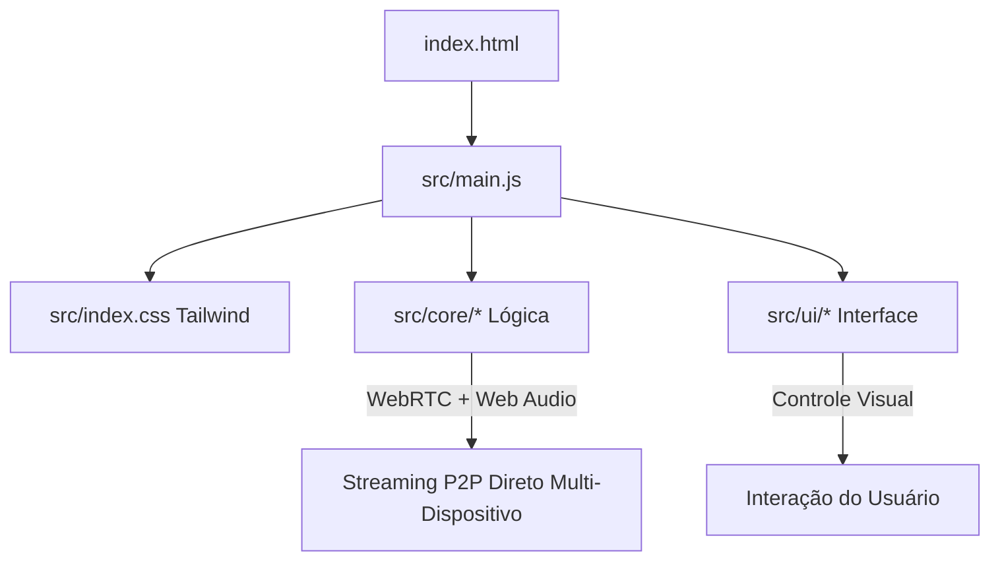

# 🧠 Guia de Aprendizado: `src/` (Frontend com Vite & Tailwind CSS)

Bem-vindo à pasta de código-fonte do **ConectaFone PRO**. Aqui reside toda a lógica do cliente web moderno construído com **JavaScript ES6+**, **Tailwind CSS** e empacotado com **Vite**.

---

## 🏗️ Como a Aplicação Funciona (Fluxo de Dados)

---

## 📂 Divisão de Responsabilidades

| Pasta / Arquivo | Função Principal |
| :--- | :--- |
| [`src/main.js`](file:///d:/Cursos/Web-SItes/Premium-HTML/Conectafone/src/main.js) | **Ponto de entrada (Bootstrap)**: Instancia os motores lógicos, registra o PWA, Vercel Analytics e alterna entre as telas. |
| [`src/core/`](file:///d:/Cursos/Web-SItes/Premium-HTML/Conectafone/src/core) | **Motores Lógicos (Sem UI)**: Contém o processamento de áudio em tempo real, conexões WebRTC P2P, captura de tela e ciclo de vida do PWA. |
| [`src/ui/`](file:///d:/Cursos/Web-SItes/Premium-HTML/Conectafone/src/ui) | **Camada Visual (DOM)**: Controla os botões, sliders de volume/delay, Auto-Sync, geração de QR Code e atualizações da interface. |
| [`src/index.css`](file:///d:/Cursos/Web-SItes/Premium-HTML/Conectafone/src/index.css) | **Estilização com Tailwind CSS v4**: Design system futurista em Glassmorphism escuro, gradientes neon e responsividade total. |

---

## 💡 Principais Conceitos para Aprender Aqui:

1. **Modularidade (ES Modules)**: Cada arquivo exporta classes ou funções específicas (`export class ...`), mantendo o código desacoplado e fácil de testar.
2. **Separação entre Lógica e Interface (Clean Architecture)**: O arquivo `audio.js` não sabe o que é um botão HTML; ele apenas processa nós de áudio. Quem conecta o slider HTML ao nó de áudio é a camada `ui/`.
3. **PWA First & Analytics**: Código pronto para funcionar offline, ser instalado como aplicativo nativo e monitorar métricas em tempo real.
